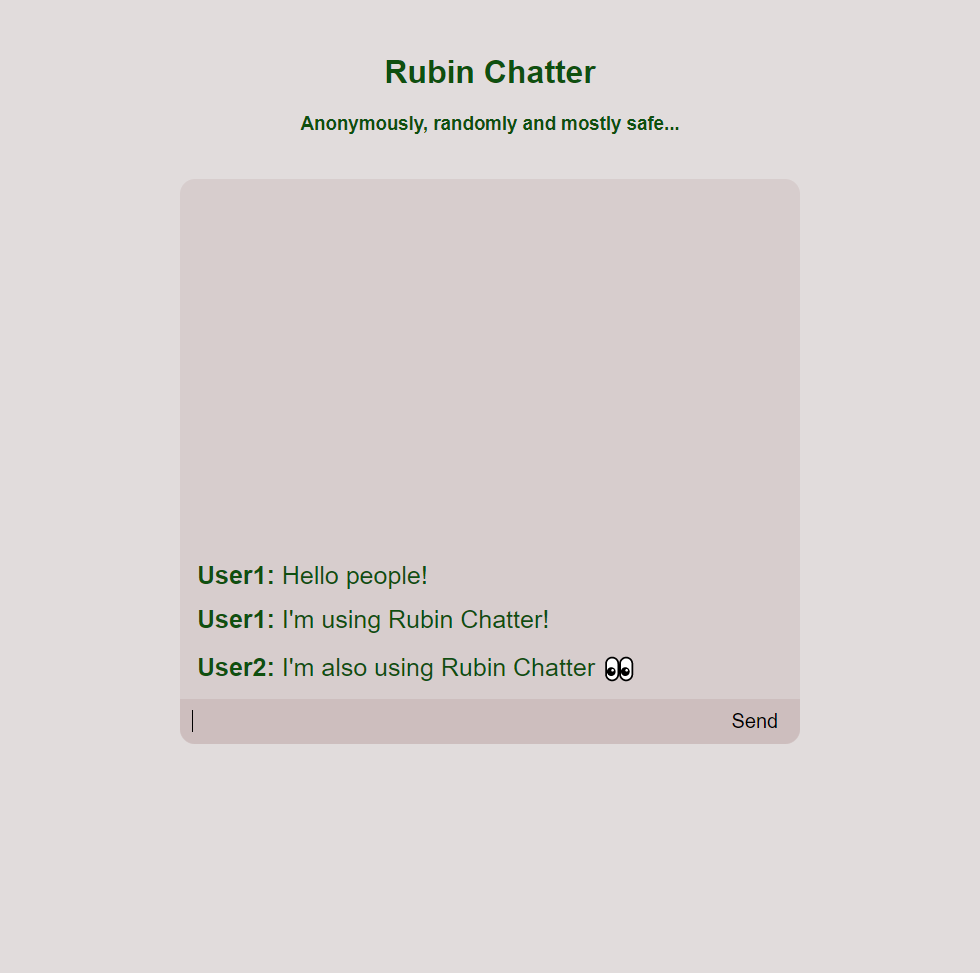

# Rubin Chatter
A simple chatting application made with Node.JS.

# About
Rubin Chatter is a website concept where people can chat anonymously and the server will store no logs. You can enter your username (most likely a nickname) and talk to random people.

# How it was made and how it works
The server-side was made using Node.JS. The server is basically an HTTP application that can respond to POST and GET requests. It stores information about the last sent messages so it can send it to the users in the correct order, but it doesn't save it to the disk and is reset each time the server restart.
The client-side was made using HTML, CSS and JS. When the client connects to the server, it makes a GET request so it can receive the last sent messages, and it keeps querying this information every 250ms so it can keep itself updated. The messages are identified by an unique id, so the server knows which is the last message that the client has and can send the remaining ones.

# How it looks like

# Notes
* This application is just a concept. It should not be used as-is in a public network becuase it is NOT safe and probably has some security breaches.
* If you want to try it for yourself, you can set your local IP address and desired port in server.js, open it in Node.JS and then connect to your IP:port in your web browser. If you want other people to be able to use it you will need to port forward the desired port, although it is not recommended for security reasons.
